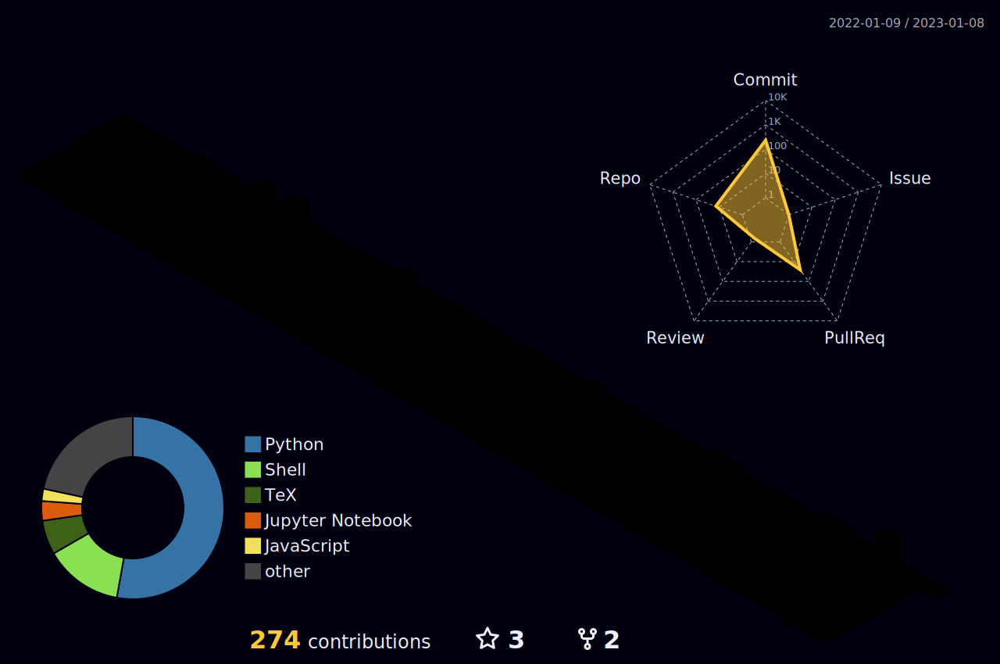

    

<h5 align="center">
  <samp>Passionate self-taught full-stack developer, data scientist, linux lover, pursuing a bachelor's degree in software engineering.</samp>
</h5>

 

  
  
  
  
  
  
  
  
  
  
  

 
 

<ul>
   <li>🔭 <b><samp>I’m currently working on .dotfiles-ws</samp></b></li>
   <li>🌱 <b><samp>I’m currently learning <b>Elixir</b></samp></b></li>
   <li>📫 <b><samp>How to reach me <b>iurie.cius@isa.utm.md</b></samp></b></li>
</ul>

<h2><samp> 🐱‍👓 Currently Working </samp></h2> 

   
   &nbsp;
   

<h2><samp> 📃 Documentation </samp></h2>

   
   &nbsp;
   

<h2><samp> 📦 Archived </samp></h2>

   
   &nbsp;
   

   
   &nbsp;
   

<!-- 👇 Thanks to Creestee -->
<h2><samp> 📈 Contribution </samp></h2>

